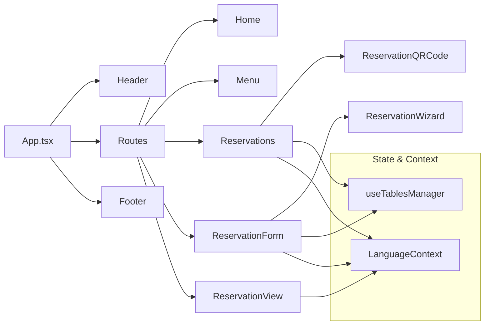

# Sistema de Reservas “Bella Vista” — Documentación Técnica

Este repositorio implementa un sistema web de reservas para un restaurante, con flujo completo desde selección de mesa y datos del cliente, hasta generación de comprobantes y QR, y vista de detalle de la reserva.

El documento describe tecnologías, arquitectura, funcionamiento, integraciones, configuración del entorno y guía de implementación, con ejemplos y diagramas para facilitar su comprensión.

## 1. Tecnologías utilizadas

- Framework: `react` (18.3.1)
  - Razón: Ecosistema maduro, renderizado declarativo, amplia compatibilidad.
- Router: `react-router-dom` (7.9.4)
  - Razón: Enrutamiento moderno, APIs simples, soporte para rutas anidadas.
- Build Tool: `vite` (7.1.10) + `@vitejs/plugin-react` (4.3.1)
  - Razón: Start-up y HMR muy rápidos, configuración mínima y DX excelente.
- Lenguaje: `typescript` (5.5.3)
  - Razón: Tipado estático, mejor mantenimiento, refactors seguros.
- Estilos: `tailwindcss` (3.4.1), `postcss` (8.4.35), `autoprefixer` (10.4.18)
  - Razón: Utilidades CSS consistentes, velocidad en UI, gran adoptación.
- Iconos: `lucide-react` (0.344.0)
  - Razón: Conjunto de íconos SVG modernos, fácil personalización.
- QR: `react-qr-code` (2.0.18)
  - Razón: Generación de códigos QR sencilla y fiable.
- Linter: `eslint` (9.9.1), `typescript-eslint` (8.3.0), `@eslint/js`, `eslint-plugin-react-hooks`, `eslint-plugin-react-refresh`, `globals`
  - Razón: Reglas modernas, soporte para TS y hooks, calidad de código.
- Opcional/Planeado: `@supabase/supabase-js` (2.57.4)
  - Estado: Presente en dependencias, no hay uso activo en el código. Posible futura integración para persistencia/analytics.

Scripts disponibles (`package.json`):
- `npm run dev`: servidor de desarrollo Vite.
- `npm run build`: build de producción.
- `npm run preview`: vista del build local.
- `npm run typecheck`: verificación estricta de tipos (`tsconfig.app.json`).
- `npm run lint`: ESLint.

## 2. Arquitectura del proyecto

Estructura principal en `src/`:
- `components/`: UI reutilizable (Header, Footer, ErrorBoundary, ReservationWizard, ReservationQRCode, etc.)
- `pages/`: Páginas de la app (Home, Menu, Reservations, ReservationForm, ReservationView, Orders)
- `hooks/`: Lógica de negocio y estado (ej. `useTablesManager`)
- `contexts/`: Contexto global (ej. `LanguageContext`)
- `config/`: Datos de configuración (zonas, horarios, menú)
- `utils/`: Utilidades (formateo de tiempo, generación de ICS/Recibo)
- `styles/`, `img/`

Diagrama de componentes principales (Mermaid):



Flujo de datos entre módulos:
- `ReservationForm`/`ReservationWizard` ↔ `useTablesManager`: selección de mesa, verificación de disponibilidad y creación de reservas.
- `useTablesManager` ↔ `localStorage`: persistencia de `reservations` y `tables`.
- `Reservations` ↔ `utils/receipt.ts`: generación de comprobante (HTML) y descarga.
- `ReservationQRCode` → QR payload JSON; `ReservationView` decodifica y muestra.

Patrones de diseño implementados:
- Hooks personalizados para lógica de negocio (`useTablesManager`).
- Contexto para i18n (`LanguageContext`) con patrón Provider/Consumer.
- Componentes funcionales y composición de UI.
- Configuración modular en `config/` para zonas, tipos de consumo y menú.
- Utilidades puras en `utils/` para tiempo, recibos y calendarios.

## 3. Funcionamiento del sistema

Resumen paso a paso del flujo de reserva:
1. Al montar la aplicación, `useTablesManager` carga `tables` y `reservations` desde `localStorage` (claves: `tables`, `reservations`).
2. `updateTablesStatus` marca cada mesa `available/occupied/reserved`:
   - Ocupada si existe reserva para hoy con diferencia ≤ 120 minutos respecto a la hora actual.
   - Reservada si hay una reserva futura (hoy más tarde o fecha futura).
3. En `ReservationForm`/`ReservationWizard` el usuario:
   - Elige fecha/hora, zona, mesa y cantidad de personas.
   - Ingresa datos del cliente y condiciones.
4. Al confirmar, `addReservation` normaliza `tableId` (convierte string a número, o lo mapea desde el wizard id) y persiste la reserva:
   - Actualiza `reservations` y `tables` en memoria y `localStorage`.
   - Emite `reservationUpdated` para notificar cambios.
   - Muestra modal de confirmación y redirige a “Reservas” tras 2 segundos.
5. En `Reservations`, se listan reservas y se puede generar un comprobante HTML con QR.
6. `ReservationView` decodifica el payload (JSON/Base64) y muestra los detalles.

Flujos de trabajo principales:
- Reserva nueva → verificación de disponibilidad → creación → recibo/QR → vista.
- Eliminación de reserva → recalculo de estados de mesa.
- Cambio de idioma → UI y textos traducidos desde `LanguageContext`.

Procesos clave y su implementación:
- Disponibilidad de mesas: `isTableAvailableForDateTime` compara reservas existentes con la ventana de 120 minutos.
- Mapeo de mesas del wizard: `WIZARD_TABLE_TO_REAL_TABLE` y `REAL_TO_WIZARD_TABLE` para compatibilidad entre UI y modelo.
- Persistencia: `localStorage` con `safeParse`, migración de nombres de ubicación legacy (`patio` → `barra`).
- Recibo y QR: `utils/receipt.ts` arma HTML con `createReservationReceiptHTML` y `downloadReceipt`; `ReservationQRCode` genera QR.

## 4. Integraciones

- Códigos QR: `react-qr-code`.
  - Protocolo de payload: JSON con campos `{ type, date, time, customerName, table, zone }`.
  - En `Reservations` se encapsula en URL: `reservation-view?data=<base64(JSON)>`.
- ICS (opcional): `utils/ics.ts` provee helpers para generar archivos ICS y descargarlos.
- Supabase (planeado): Dependencia presente, no hay uso activo en el código actual.

## 5. Configuración del entorno

Requisitos del sistema:
- Node.js ≥ 18.
- npm ≥ 8.
- Navegador moderno (Chrome, Edge, Firefox, Safari).

Instalación de dependencias:
```bash
npm install
```

Variables de entorno:
- `VITE_PUBLIC_BASE_URL` (opcional): base pública para construir URLs de QR. Por defecto se usa `window.location.origin`.

## 6. Guía de implementación

Compilar y ejecutar:
```bash
# Desarrollo
npm run dev

# Build producción
npm run build

# Previsualizar build
npm run preview

# Verificación de tipos
npm run typecheck

# Lint
npm run lint
```

Ejemplos de uso

- Crear una reserva desde un componente (uso de `useTablesManager`):
```tsx
import { useTablesManager } from '../hooks/useTablesManager';

export default function MakeReservationButton() {
  const { addReservation } = useTablesManager();

  const onClick = () => {
    addReservation({
      date: '2025-01-01',
      time: '20:00',
      tableId: '5', // o table: 'T1' desde wizard
      adults: 2,
      children: 0,
      babies: 0,
      customerName: 'Juan Pérez',
      customerEmail: 'juan@example.com',
      customerPhone: '+51 999999999',
      zone: 'terraza',
      consumptionType: 'dinner',
      specialRequests: 'Mesa cerca de la ventana'
    });
  };

  return <button onClick={onClick}>Reservar</button>;
}
```

- Generar comprobante HTML y descargar (desde `Reservations`):
```ts
import { createReservationReceiptHTML, downloadReceipt } from '../utils/receipt';

const html = createReservationReceiptHTML({
  date: '2025-01-01',
  time: '20:00',
  customerName: 'Juan Pérez',
  guests: 2,
  tableLabel: 'Mesa 5',
  zoneLabel: 'Terraza',
  consumptionTypeLabel: 'Cena',
  phone: '+51 999999999',
  email: 'juan@example.com',
  location: 'Bella Vista — Av. Principal 123, Lima',
  qrUrl: 'https://miapp.com/reservation-view?data=...'
}, {
  title: 'Comprobante de Reserva',
  date: 'Fecha',
  time: 'Hora',
  customer: 'Cliente',
  guests: 'Comensales',
  table: 'Mesa',
  zone: 'Zona',
  consumption: 'Consumo',
  phone: 'Teléfono',
  email: 'Email',
  notes: 'Notas',
  location: 'Ubicación',
  qr: 'Código QR'
});

downloadReceipt('Reserva_Juan_Perez.html', html);
```

- Construcción del payload de QR y uso:
```tsx
import ReservationQRCode from '../components/ReservationQRCode';

<ReservationQRCode
  data={{
    date: '2025-01-01',
    time: '20:00',
    customerName: 'Juan Pérez',
    table: 5,
    zone: 'terraza'
  }}
/>;
```

Casos de prueba recomendados
- `useTablesManager.addReservation`:
  - `tableId` como string vs número (coerción correcta).
  - Capacidad mínima de mesa vs número de comensales.
  - Conflictos de horario en la ventana de 120 minutos.
  - Persistencia en `localStorage` y recalculo de estados.
- `ReservationQRCode` y `ReservationView`:
  - Codificación/decodificación JSON y Base64.
  - URL generada con/ sin `VITE_PUBLIC_BASE_URL`.
- `LanguageContext`:
  - Alternancia entre `es` y `en`, verificación de etiquetas.
- `Menu`:
  - Render de imágenes, uso de `placeholder.svg` como fallback.

## 7. Eliminación de animaciones y transiciones (sitio estático)

Con el objetivo de entregar una experiencia completamente estática, se eliminaron todas las animaciones y transiciones a nivel global y de componentes.

- Global CSS (`src/index.css`):
  - Se removieron `@keyframes`, utilidades de animación y clases personalizadas relacionadas.
  - Se añadió un override en `@layer base` para forzar `animation: none !important` y `transition: none !important` en todos los elementos y pseudo-elementos.
  - Se estableció `scroll-behavior: auto`.

- Home (`src/pages/Home.tsx`):
  - Eliminado parallax y cualquier lógica de revelado por scroll.
  - Eliminados elementos decorativos con clases `animate-*` y `animate-pulse`.
  - Removidas clases de `hover:` y `transition-*` en botones e imagen del hero.

- Menú (`src/pages/Menu.tsx`):
  - Eliminado `IntersectionObserver` y lógica de `scroll-reveal`.
  - Removidas clases `scroll-reveal-*`, `reveal-delay-*`, `hover:` y `transition-*` en items.

- Reservas y Admin:
  - `src/pages/Reservations.tsx`: Removidas clases `hover:` y `transition-*` en botones y tarjetas.
  - `src/pages/admin/ReservationsAdmin.tsx`, `Dashboard.tsx`, `Settings.tsx`, `MenuAdmin.tsx`: Removidas clases `hover:` y `transition-*` en contenedores y botones.

- Estilos comunes (`src/styles/common.css`):
  - Eliminadas utilidades que aplicaban `hover:*`, transformaciones (`scale`, `translate`), y `transition-*`.
  - Se vació `.hover-lift` para evitar errores de Tailwind por `@apply` vacío.

Criterios a seguir (futuro):
- No usar clases `hover:*`, `group-hover:*`, `transition-*`, `duration-*`, `ease-*` o `animate-*`.
- Mantener estilos de foco (`focus:*`) para accesibilidad, evitando transiciones.
- Cualquier interacción debe ser inmediata y sin efectos animados.
- Si se requiere reintroducir animaciones en un entorno aislado, hacerlo explícitamente en componentes específicos sin tocar la capa global.

Verificación:
- El servidor de desarrollo (`npm run dev`) se levantó y se revisó la UI en `http://localhost:5176/` confirmando contenido estático sin animaciones.
- `utils/ics.ts` (si se activa):
  - Generación de ICS con duración y datos mínimos.

## 7. Notas de diseño y decisiones

- Ventana de ocupación: 120 minutos por reserva; simplifica la gestión sin backend.
- Migración legacy: ubicación `patio` → `barra` para compatibilidad con datos antiguos.
- Redirección post-confirmación: 2 segundos para una UX fluida tras el modal de éxito.
- i18n: `LanguageContext` provee `t(key)` para traducir textos de UI.

## 8. Estructura de rutas

- `/` → Home
- `/menu` → Carta
- `/reservations` → Listado y acciones (recibo/QR)
- `/reservation-form` → Flujo guiado de reserva
- `/reservation-view` → Vista detalle decodificada desde QR/URL

## 9. Contribución y estilo de código

- Tipado estricto (`strict`, `noUnusedLocals`, `noUnusedParameters`, `noFallthroughCasesInSwitch`).
- ESLint con reglas para hooks y exportaciones de React.
- Mantener componentes funcionales, hooks para lógica, utilidades puras.
- Estilos con Tailwind; evitar CSS complejo cuando no sea necesario.

---

Para dudas o mejoras (p. ej., integración real con Supabase, autenticación, inventario o notificaciones), abrir un issue o proponer un PR.